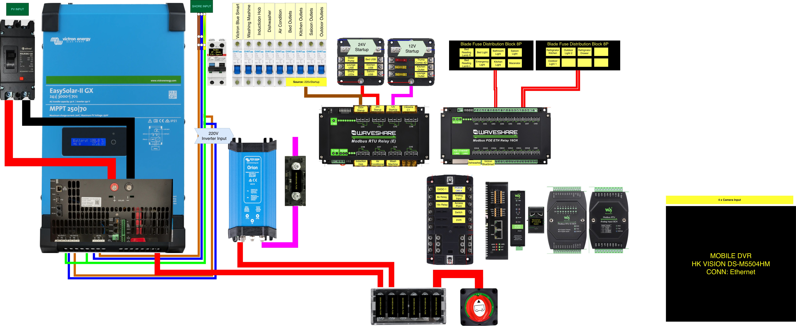

# Karavan Geliştirme Planı

Iveco Daily / MAN TGE 18m³ karavan dönüşüm projesi için sıralı iş planı ve malzeme listeleri (BOM).

Her adımda:
- **Sorumlu**: DIY veya FİRMA
- **Bağımlılık**: Hangi adım(lar)dan sonra başlayabilir
- **BOM Tablosu**: Ürün, Model, Adet, Tahmini Fiyat, Önden Alınabilir (E/H)

---

## Adım 0 — Otomasyon Geliştirme (Evde)
> **DIY** | Bağımlılık: Yok

Otomasyon yazılımının ve donanımlarının tedariki. Home Assistant kurulumu, Modbus entegrasyonu, DI/DO testleri, kontrol paneli ekranı entegrasyonu. Araç olmadan evde masaüstünde yapılır.

| # | Ürün | Model | Adet | Fiyat | Kaynak |
|---|------|-------|------|-------|--------|
| 1 | Ana Bilgisayar Kasası | Waveshare IPCBOX-CM5-A (4x RS485, CAN, 2DI/2DO, dual ETH, 7-36V) | 1 | ~4.400 ₺ | [Waveshare](https://www.waveshare.com/ipcbox-cm5-a.htm) |
| 2 | CM5 Modül | Raspberry Pi CM5 8GB Lite (eMMC'siz, BCM2712 2.4GHz) | 1 | ~3.000 ₺ | SAMM Market |
| 3 | NVMe SSD | 512GB M.2 2242 NVMe (Kioxia / WD) | 1 | ~1.000 ₺ | Genel |
| 4 | DI/DO Modülü | Waveshare Modbus RTU IO 8CH (8DI/8DO, RS485) | 1 | ~1.428 ₺ | [SAMM Market](https://market.samm.com/endustriyel-8-kanalli-dijital-giris-ve-cikis-modulu) |
| 5 | Analog Giriş Modülü | Waveshare 8-Ch Analog Acquisition (RS485) | 1 | ~1.555 ₺ | SAMM Market |
| 6 | Araç Aküsü Float Şarj / Dev PSU | Victron Blue Smart IP65 12/5A (220V AC→12V DC, 60W) | 1 | ~5.000 ₺ | Tekmobil / MarinReyon |
| 7 | Sigortalı Dağıtım Kutusu | 12'li İkaz Işıklı Negatif Barali Sigorta Kutusu | 1 | ~1.225 ₺ | karavanicin.com |
| 8 | RS485 Kablo + Konnektör | CAT5e/shielded + terminal bloklar | 1 set | ~500 ₺ | Genel |
| 9 | Kontrol Paneli Ekranı | Waveshare 11.9" HDMI LCD 320×1480 IPS Touch (Capacitive, Toughened Glass) | 1 | ~4.538 ₺ | [Waveshare](https://www.waveshare.com/11.9inch-HDMI-LCD.htm) |
| 10 | Mobile DVR | HK Vision DS-M5504HM (4 kanal, Ethernet) | 1 | TBD | TBD |
| 11 | Network Switch | TBD | 1 | TBD | TBD |
| 12 | Access Point | TBD (Wi-Fi) | 1 | TBD | TBD |
| | | | | **~22.646 ₺ + TBD** | |

> **Kur:** 1 USD = 44,07 ₺, 1 EUR = 51,21 ₺ (17 Şubat 2026). Fiyatlar ±%15 sapabilir.

### Adım 0 Kapsam Açıklama

- **#1-3**: Waveshare IPCBOX-CM5-A endüstriyel kutu + RPi CM5 8GB + 512GB NVMe SSD = Home Assistant ana bilgisayar (4x RS485, CAN, 2DI/2DO, 7-36V DC direkt besleme, dual ETH)
- **#4**: 1x 8DI/8DO → push button (DI), valf / kontaktör bobini (DO); yük anahtarlama Waveshare Modbus röle modülleri (RTU 8CH + POE ETH 16CH)
- **#5**: Su tankı seviye sensörleri, sıcaklık okumaları
- **#6**: Victron Blue Smart IP65 12/5A (220V AC → 12V DC) — geliştirme sürecinde otomasyon cihazlarının güç kaynağı olarak kullanılır, karavanda EasySolar-II AC OUT 1'den Waveshare relay ile araç aküsü float şarj (shore yokken de inverter üzerinden çalışır)
- **#7**: DC taraf sigorta dağıtımı
- **#8**: Modüller arası RS485 haberleşme kablolaması
- **#9**: Kontrol paneli ekranı — giriş kapısı üstü, HDMI + USB direkt IPCBOX-CM5-A bağlantısı, HA dashboard

---

## Adım 1 — Ön Hazırlık ve Malzeme Tedariği
> **DIY** | Bağımlılık: Yok (Adım 0 ile paralel)

Uzun tedarik süreli ve önden alınabilecek malzemelerin toplu siparişi. Tüm adımlardan "Önden = E" olanlar bu aşamada sipariş edilebilir.

---

## Adım 2 — Araç Alımı
> **DIY** | Bağımlılık: Yok

Iveco Daily veya MAN TGE 18m³ aracın satın alımı.

---

## Adım 3 — Kabuk Hazırlık (Kesim ve Dış Montaj)
> **FİRMA** | Bağımlılık: Adım 2

Araç kaportasına yapılacak kesim, pencere montajı, tavan klima hazırlığı, güneş paneli ray sistemi ve panel montajı, tente montajı ve yapısal takviye işleri. Firma tarafından yapılmalı.

| Ürün | Model | Adet | Fiyat | Önden |
|------|-------|------|-------|-------|
| Heki (tavan pencere) | Dometic Midi Heki Style 70x50cm | 1 | TBD | E |
| Yan pencere büyük | Karavan pencere 100x50cm | 1 | TBD | E |
| Yan pencere orta | Karavan pencere 60x50cm | 4 | TBD | E |
| Tavan Klima | Evacool Eva RV 2700 Premium | 1 | ~76.500 ₺ | E |
| Güneş Paneli | 200W rigid monokristal | 4 | TBD | E |
| Çatı Ray Sistemi | Alüminyum montaj rayı + bağlantı seti | 1 set | TBD | E |
| MC4 Konnektör + Kablo | Solar kablo 4mm² + MC4 | 1 set | TBD | E |
| Tente | Thule Omnistor 6300 (4.0m, L4) | 1 | TBD | E |
| Banyo Penceresi | Açılabilir buzlu cam ~30x40cm | 1 | TBD | E |

> Not: Pencere, heki ve güneş paneli yerleşimi firma ile birlikte netleştirilecek. Paneller klima ünitesi ve heki ile çakışmayacak şekilde konumlandırılacak. 2S2P konfigürasyon (kısmi gölge dayanıklılığı) önerilir.

---

## Adım 4 — Yalıtım
> **DIY** | Bağımlılık: Adım 3

Ses ve ısı yalıtımının tamamlanması. Kabuk hazırlıktan sonra, kablo döşemeden önce.

| Ürün | Model | Adet | Fiyat | Önden |
|------|-------|------|-------|-------|
| Ses yalıtım plakası | CTP/Dinamat ses yalıtım | TBD m² | TBD | E |
| Isı yalıtımı | Folyolu yapışkanlı elastomerik kauçuk | TBD m² | TBD | E |

---

## Adım 5 — Elektrik Altyapı: Ekipman Montajı + Kablo Döşeme
> **DIY** | Bağımlılık: Adım 4

Ana yatak altı teknik alana batarya, inverter (EasySolar-II), otomasyon panosu, Orion XS ve dağıtım donanımlarının fiziksel montajı. Ardından tüm elektrik kablolarının duvar/tavan/zemin altına döşenmesi. Güneş paneli kabloları (Adım 3) bu aşamada EasySolar-II MPPT'ye bağlanır. **İç kaplama yapılmadan ÖNCE tamamlanmalı.**

**Merkezi Ekipman (Teknik Alan)**

| Ürün | Model | Adet | Fiyat | Önden |
|------|-------|------|-------|-------|
| LiFePO4 Hücre | EVE 3.2V 280Ah prizmatik | 8 | TBD | E |
| BMS | JBD/Overkill 8S 200A RS485/CAN | 1 | TBD | E |
| İnverter/Şarj/MPPT | Victron EasySolar-II 3kVA MPPT 250/70 GX | 1 | TBD | E |
| DC-DC Şarj | Victron Orion XS 1400 | 1 | TBD | E |
| Relay Modülü (8CH) | Waveshare Modbus RTU Relay (RS485, master + dağıtılmış kanallar) | 1 | ~2.500 ₺ | E |
| Relay Modülü (16CH) | Waveshare POE ETH 16CH Relay | 1 | ~4.500 ₺ | E |
| Blade Fuse Block | 8 pozisyonlu blade sigorta dağıtım bloğu | 2 | ~500 ₺ | E |
| 220V Sigorta Kutusu | Panasonic sıva üstü modüler sigorta kutusu | 1 | ~500 ₺ | E |
| MCB Sigortalar | CHNT C16 otomatik sigorta | 9 | ~720 ₺ | E |
| Kaçak Akım Rölesi | 30mA, 2P | 1 | TBD | E |
| Ana Sigorta | MEGA/ANL 200A | 1 | TBD | E |
| Ana Kontaktör | 24V DC, 200A | 1 | TBD | E |
| Shore Power Girişi | Marin tip priz IP67, 16A | 1 | TBD | E |
| Ana akım kablosu | 16mm² (batarya-inverter) | ~5m | TBD | E |

**Kablolama**

| Ürün | Model | Adet | Fiyat | Önden |
|------|-------|------|-------|-------|
| AC Kablo | NYAF 4mm² (220V hatlar) | ~100m | TBD | E |
| DC Kablo (sinyal/aydınlatma) | NYAF 2.5mm² (24V/12V) | ~150m | TBD | E |
| DC Kablo (yüksek akım) | NYAF 4mm² (24V yüksek akım) | ~50m | TBD | E |
| Kablo koruyucu | Yanmaz spiral kablo koruyucu | TBD m | TBD | E |
| Buat/Junction box | Elektrik buatları | ~20 | TBD | E |
| RS485 Haberleşme kablosu | CAT5e shielded | ~30m | TBD | E |
| Kablo bağı + klips | Montaj malzemesi | 1 set | TBD | E |

> Not: Kablo güzergahları aşağıdaki pano şeması ve kanal haritalarına göre planlanır.

### Elektrik Panosu

### 220V MCB Panel (9x CHINT)

Tüm MCB hatları **8CH Relay CH1 (220V Startup)** üzerinden beslenir. Yüksek güçlü cihazlar ek olarak bireysel relay kontrolündedir.

| # | MCB Etiketi | Bölge | Bireysel Relay Kontrolü |
|---|-------------|-------|------------------------|
| 1 | Victron Blue Smart | Teknik alan | 16CH Relay (float şarj) |
| 2 | Washing Machine | Banyo | 8CH Relay CH6 |
| 3 | Induction Hob | Mutfak | 8CH Relay CH8 |
| 4 | Dishwasher | Mutfak | 16CH Relay (bulaşık makinesi) |
| 5 | Air Condition | Ana Yatak | 8CH Relay CH7 |
| 6 | Bed Outlets | Ana Yatak | Yok — 220V Startup ile aktif |
| 7 | Kitchen Outlets | Mutfak | Yok — 220V Startup ile aktif |
| 8 | Saloon Outlets | Oturma | Yok — 220V Startup ile aktif |
| 9 | Outdoor Outlets | Dış | Yok — 220V Startup ile aktif |

> Yüksek güçlü 220V cihazlar (çamaşır makinesi, indüksiyon ocak, klima, bulaşık makinesi, Victron BlueSmart) bireysel relay kontrolündedir. HA yük yönetimi ile inverter modunda eş zamanlı çalışma önlenir. Outlet hatları sadece MCB korumalı, 220V Startup ile toplu açılır.

### Waveshare Modbus RTU Relay (E) — 8 Kanal

Master startup röleleri ve yüksek güçlü 220V cihaz kontrolü. RS485 üzerinden Modbus ile yönetilir.

| CH | Yük | Tip | Detay |
|----|-----|-----|-------|
| CH1 | 220V Startup | Master | MCB paneli besleme (outlet hatları) |
| CH2 | 24V Startup | Master | 24V dağıtım bloğu |
| CH3 | 12V StartUp | Master | 12V dağıtım bloğu |
| CH4 | Clesana C1 | 12V | Susuz tuvalet (banyo) |
| CH5 | Rezerv | - | Boş |
| CH6 | Washing Machine | 220V | Çamaşır makinesi |
| CH7 | Air Conditioner | 220V | Klima (Evacool RV 2700) |
| CH8 | Induction Hob | 220V | İndüksiyon ocak (Thetford) |

### Waveshare Modbus POE ETH Relay — 16 Kanal

Aydınlatma, DC cihazlar ve ek 220V cihaz kontrolü. POE Ethernet üzerinden Modbus ile yönetilir.

**Blade Fuse Block #1 — Aydınlatma + Macerator (8P, tümü dolu)**

| CH | Blade Fuse Pos | Yük | Voltaj |
|----|---------------|-----|--------|
| CH1 | 1 | Bed Reading Lamp R (okuma lambası sağ) | 24V |
| CH2 | 2 | Bed Light (yatak tavan aydınlatma) | 24V |
| CH3 | 3 | Bathroom Light (banyo aydınlatma) | 24V |
| CH4 | 4 | Saloon Light (oturma aydınlatma) | 24V |
| CH5 | 5 | Bed Reading Lamp L (okuma lambası sol) | 24V |
| CH6 | 6 | Emergency Light (acil aydınlatma) | 24V |
| CH7 | 7 | Kitchen Light (mutfak aydınlatma) | 24V |
| CH8 | 8 | Macerator (macerator pompa) | 24V |

**Blade Fuse Block #2 — DC Cihazlar (8P, 4 dolu + 4 rezerv)**

| CH | Blade Fuse Pos | Yük | Voltaj |
|----|---------------|-----|--------|
| CH9 | 1 | Refrigerator Kitchen (Evacool Eva Berlin, mutfak) | 24V |
| CH10 | 2 | Outdoor Light 2 (dış aydınlatma 2) | 24V |
| CH11 | 3 | Refrigerator Drawer (Evacool D31 R, kanepe altı) | 24V |
| CH12 | 4 | Outdoor Light 1 (dış aydınlatma 1) | 24V |
| - | 5-8 | Rezerv | - |

**220V Doğrudan Kontrol (Blade Fuse Block dışı)**

| CH | Yük | Detay |
|----|-----|-------|
| CH15 | Dishwasher | Bulaşık makinesi (Electrolux), 220V |
| CH16 | Victron BlueSmart | Float şarj (Victron Blue Smart IP65), 220V |

> CH13-CH14: Rezerv (Block #2 boş slotlarına bağlanabilir).

### 24V Startup Dağıtım

8CH Relay CH2 (24V Startup) aktif olduğunda aşağıdaki çıkışlar beslenir:

| Çıkış | Detay |
|--------|-------|
| Water Pump | 24V su pompası |
| Bed USB | Ana yatak USB-C soketleri |
| Kitchen USB | Mutfak USB-C soketleri |
| Saloon USB | Oturma USB-C soketi |
| Lounge USB | Kanepe USB-C soketi |
| Strip LEDs | Shelly RGBW PM besleme (LED strip) |

### 12V Startup Dağıtım

8CH Relay CH3 (12V StartUp) aktif olduğunda aşağıdaki çıkışlar beslenir:

| Çıkış | Detay |
|--------|-------|
| Truma Combi 4D | Isıtma + sıcak su sistemi (12V kontrol) |
| Kitchen Outlet | Mutfak 12V priz |

> Clesana C1 ayrıca 8CH Relay CH4 üzerinden bireysel kontrollüdür, 12V Startup'a bağlı değildir.

### Kanal Özeti

| Kaynak | Toplam | Kullanılan | Rezerv |
|--------|--------|------------|--------|
| 8CH RTU Relay | 8 | 7 | 1 |
| 16CH POE ETH Relay | 16 | 14 | 2 |
| Blade Fuse Block #1 (8P) | 8 | 8 | 0 |
| Blade Fuse Block #2 (8P) | 8 | 4 | 4 |

---

## Adım 6 — Su 1. Fix: Boru Döşeme
> **DIY** | Bağımlılık: Adım 4

PEX boruların duvar/zemin altına döşenmesi. **İç kaplama yapılmadan ÖNCE tamamlanmalı.**

| Ürün | Model | Adet | Fiyat | Önden |
|------|-------|------|-------|-------|
| PEX Boru (soğuk su) | 16mm PEX-A | ~20m | TBD | E |
| PEX Boru (sıcak su) | 16mm PEX-A (izoleli) | ~15m | TBD | E |
| Gri su borusu | 28-32mm esnek hortum | ~10m | TBD | E |
| Bağlantı elemanları | Press fitting / push-fit set | 1 set | TBD | E |

---

## Adım 7 — Banyo Altyapı: Fiber Zemin
> **DIY** | Bağımlılık: Adım 5, Adım 6

Banyo (70x180cm dik tam genişlik) ve su alanı için fiber kompozit zemin yapımı.

| Ürün | Model | Adet | Fiyat | Önden |
|------|-------|------|-------|-------|
| Fiber elyaf | Cam elyaf kumaş | TBD m² | TBD | E |
| Epoksi reçine | Laminasyon epoksi + sertleştirici | TBD kg | TBD | E |
| XPS levha | Yoğun XPS köpük | TBD m² | TBD | E |
| Son kat boya | PU beyaz boya (su geçirmez) | TBD lt | TBD | E |

---

## Adım 8 — Sigma Profil İskelet (Mobilya Altyapısı)
> **DIY** | Bağımlılık: Adım 4

Tüm mobilya iskeletlerinin sigma (aluminyum ekstrüzyon) profilden yapımı. İç kaplama bu iskeletlerin etrafına uygulanacağı için **kaplamadan ÖNCE** tamamlanmalı.

| Ürün | Model | Adet | Fiyat | Önden |
|------|-------|------|-------|-------|
| Sigma Profil | 30x30 ve 30x60 alüminyum ekstrüzyon | TBD m | TBD | E |
| Köşe bağlantı elemanları | L/T braketi, cıvata seti | 1 set | TBD | E |
| Ana yatak çerçevesi | 200x180cm sigma iskelet (yatak altı teknik alan erişimli) | 1 | TBD | H |
| Kanepe-yatak çerçevesi | 200x70cm sigma iskelet (tek kişilik yatak dönüşümlü, kanepe altı çekmeceli buzdolabı alanı) | 1 | TBD | H |
| Mutfak dolabı iskeleti | Tezgah + alt dolap + üst dolap sigma çerçeve | 1 set | TBD | H |
| Yatak altı çekmeceler | Teknik alan erişimli çekmece rayları | TBD | TBD | H |
| Lagun Masa | 40x80cm, 360° döner, sökülebilir | 2 | TBD | E |

---

## Adım 9 — Su Depoları (Şasi Altı)
> **FİRMA** | Bağımlılık: Adım 2

Şasi altına temiz ve gri su depolarının montajı. Adım 3 ile paralel yapılabilir.

| Ürün | Model | Adet | Fiyat | Önden |
|------|-------|------|-------|-------|
| Temiz su deposu | Polietilen, gıda uyumlu | 1 (180L) | TBD | H |
| Gri su deposu | Polietilen | 1 (90L) | TBD | H |
| Temiz su şamandıra | Seviye sensörü | 1 | TBD | E |
| Gri su şamandıra | Seviye sensörü | 1 | TBD | E |
| Temiz su boşaltma vanası | Manuel vana | 1 | TBD | E |
| Gri su boşaltma vanası | Manuel vana | 1 | TBD | E |

> Not: Depo boyutları aracın şasi ölçülerine göre belirlenecek.

---

## Adım 10 — İç Kaplama (Duvar, Tavan, Zemin)
> **DIY / FİRMA** | Bağımlılık: Adım 5, Adım 6, Adım 7, Adım 8

Elektrik ve su 1. fix tamamlandıktan sonra duvar, tavan ve zemin kaplaması.

| Ürün | Model | Adet | Fiyat | Önden |
|------|-------|------|-------|-------|
| Duvar kaplama | TBD (ahşap panel / lamine) | TBD m² | TBD | H |
| Tavan kaplama | TBD (hafif panel) | TBD m² | TBD | H |
| Zemin döşeme | TBD (vinil / lamine parke) | TBD m² | TBD | H |

> Not: Malzeme seçimleri iç tasarım kararlarına bağlı, araç ölçüldükten sonra netleştirilecek.

---

## Adım 11 — Elektrik Bağlantı Tamamlama
> **DIY** | Bağımlılık: Adım 5, Adım 10

Adım 5'te yerleştirilen merkezi ekipman ve döşenen kabloların, iç kaplama (Adım 10) sonrası uç noktalarına sonlandırılması. Pano içi kablo bağlantıları, sigorta atamaları ve RS485 bus terminasyonlarının tamamlanması.

- [ ] Tüm kablo uçlarının panoya terminasyonu
- [ ] Waveshare relay modüllerinin Modbus konfigürasyonu
- [ ] RS485 bus sonlandırma dirençleri
- [ ] Batarya hücre bağlantıları ve BMS konfigürasyonu
- [ ] EasySolar-II AC/DC bağlantıları
- [ ] Shore power hattı sonlandırma

### DI/DO Kanal Dağılımı (1x Waveshare 8DI/8DO)

**DI Kanalları — Push Button Input**

| DI | Bağlantı | İşlev |
|----|----------|-------|
| DI1 | Mutfak PB | Mutfak aydınlatma toggle |
| DI2 | Oturma PB | Oturma aydınlatma toggle |
| DI3 | Yatak Başı Sol PB 1 | Tavan aydınlatma toggle |
| DI4 | Yatak Başı Sol PB 2 | Sol okuma lambası toggle |
| DI5 | Yatak Başı Sağ PB 1 | Tavan aydınlatma toggle |
| DI6 | Yatak Başı Sağ PB 2 | Sağ okuma lambası toggle |
| DI7 | Banyo PB | Banyo aydınlatma toggle |
| DI8 | Rezerv | - |

**DO Kanalları — Rezerv**

| DO | Bağlantı |
|----|----------|
| DO1-DO8 | Rezerv (gelecek genişleme) |

> Eski mimarideki DO → bistable röle toggle mekanizması kaldırılmıştır. Relay switching artık doğrudan Waveshare relay modülleri üzerinden Modbus ile yapılır. DO kanalları gelecek genişleme için ayrılmıştır.

| Kaynak | Toplam | Kullanılan | Rezerv |
|--------|--------|------------|--------|
| DI (1× DI/DO) | 8 | 7 | 1 |
| DO (1× DI/DO) | 8 | 0 | 8 |

---

## Adım 12 — Su Tesisatı Tamamlama
> **DIY** | Bağımlılık: Adım 9, Adım 10

Su tesisatının cihazlara bağlanması, pompa ve ısıtma sistemi montajı.

| Ürün | Model | Adet | Fiyat | Önden |
|------|-------|------|-------|-------|
| Hidrofor (su pompası) | 24V DC basınçlı pompa | 1 | TBD | E |
| Genleşme kabı | 24V balonlu tip | 1 | TBD | E |
| Macerator pompa | SHURflo 24V | 1 | TBD | E |
| Isıtma + Sıcak Su | Truma Combi 4D (12V, dizel) | 1 | TBD | E |
| Truma Kontrol | Truma iNet CP plus | 1 | TBD | E |
| Truma Hava Dağıtım | İzoleli hortum + menfez kiti | 1 set | TBD | E |
| Truma Yakıt Kiti | Yakıt pompası, filtre, dizel hat | 1 set | TBD | E |
| Sıcak su dağıtım kollektörü | Pirinç kollektör | 1 | TBD | E |
| Soğuk su dağıtım kollektörü | Pirinç kollektör | 1 | TBD | E |
| Actuator valf | 24V otomatik vana (donma koruması) | 1 | TBD | E |
| Çamaşır Makinesi | FİX Mini 3kg (bagaj su servis alanı) | 1 | TBD | E |

---

## Adım 13 — Elektrik 2. Fix: Priz, Aydınlatma, Push Button
> **DIY** | Bağımlılık: Adım 10, Adım 11

Kabloları daha önce döşedik (Adım 5). Şimdi uç cihazların montajı.

| Ürün | Model | Adet | Fiyat | Önden |
|------|-------|------|-------|-------|
| 220V Priz | Sıva üstü karavan tipi | 8 | TBD | E |
| 12V Priz | DC priz | 1 | TBD | E |
| USB-C Soket | Otomotiv 100W PD (24V giriş) | 8 | TBD | E |
| Push Button | Anlık buton (NO) | 7 | TBD | E |
| LED Spot | 24V LED spot armatür | TBD | TBD | E |
| LED Şerit | 24V RGB LED şerit (Ana yatak tavan) | TBD m | TBD | E |
| LED Şerit | 24V RGB LED şerit (Oturma ambient) | TBD m | TBD | E |
| Shelly Plus RGBW PM | Wi-Fi dimmer + renk, 24V | 2 | ~2.450 ₺ | E |

### Priz ve Soket Yerleşimi

| Bölge | Konum | 220V | 12V | USB-C (100W PD) | Toplam |
|-------|-------|------|-----|------------------|--------|
| **Ana Yatak** | Yatak Başı Sol (Mutfak tarafı) | 1 | - | 2 | 3 |
| **Ana Yatak** | Yatak Başı Sağ (Banyo tarafı) | 1 | - | 2 | 3 |
| **Ana Yatak** | Yatak Ayak Ucu (Banyo tarafı) | 1 | - | - | 1 |
| **Mutfak** | Tezgah üstü | 2 | 1 | 2 | 5 |
| **Oturma/Yatak** | Kanepe karkası altı (sol+sağ) | 2 | - | 2 | 4 |
| **Banyo** | Lavabo / duvar | 1 | - | - | 1 |
| **TOPLAM** | | **8** | **1** | **8** | **17** |

### Push Button Yerleşimi

| Bölge | Konum | Adet | İşlev | Bağlantı |
|-------|-------|------|-------|----------|
| **Mutfak** | Tezgah üstü / dolap | 1 | Mutfak aydınlatma | DI → HA → 16CH Relay |
| **Oturma/Yatak** | Duvar | 1 | Oturma aydınlatma | DI → HA → 16CH Relay |
| **Ana Yatak** | Yatak Başı Sol | 2 | Tavan aydınlatma, sol okuma lambası | DI → HA → 16CH Relay |
| **Ana Yatak** | Yatak Başı Sağ | 2 | Tavan aydınlatma, sağ okuma lambası | DI → HA → 16CH Relay |
| **Banyo** | Lavabo / duvar | 1 | Banyo aydınlatma | DI → HA → 16CH Relay |
| **TOPLAM** | | **7** | | |

> Push buttonlar Waveshare DI modülüne bağlıdır. HA butona basışı algılar ve ilgili Waveshare relay kanalını Modbus üzerinden doğrudan toggle eder.

### Aydınlatma Noktaları

| Bölge | Tip | Voltaj | Kontrol | Push Button |
|-------|-----|--------|---------|-------------|
| **Ana Yatak** | Tavan LED (Bed Light) | 24V | 16CH Relay + Shelly RGBW PM (dimmer+renk) | Yatak başı sol + sağ PB |
| **Ana Yatak** | Okuma lambası sol (Reading Lamp L) | 24V | 16CH Relay | Yatak başı sol PB |
| **Ana Yatak** | Okuma lambası sağ (Reading Lamp R) | 24V | 16CH Relay | Yatak başı sağ PB |
| **Ana Yatak** | Acil aydınlatma (Emergency Light) | 24V | 16CH Relay | HA otomasyon |
| **Mutfak** | Mutfak aydınlatma (Kitchen Light) | 24V | 16CH Relay | Mutfak PB |
| **Oturma/Yatak** | Oturma aydınlatma (Saloon Light) | 24V | 16CH Relay | Oturma PB |
| **Oturma/Yatak** | Ambient aydınlatma | 24V | Shelly Plus RGBW PM (dimmer+renk) | HA / Shelly |
| **Banyo** | Banyo aydınlatma (Bathroom Light) | 24V | 16CH Relay | Banyo PB |
| **Dış** | Dış aydınlatma 1 (Outdoor Light 1) | 24V | 16CH Relay | HA otomasyon |
| **Dış** | Dış aydınlatma 2 (Outdoor Light 2) | 24V | 16CH Relay | HA otomasyon |

### Shelly Plus RGBW PM (Wi-Fi, 2 adet)

24V Startup rail'den beslenir. LED strip dimmer + renk kontrolü.

| # | Konum | İşlev | Besleme |
|---|-------|-------|---------|
| 1 | Ana Yatak | Tavan LED — dimmer + renk (16CH Relay CH2 Bed Light downstream) | 24V via Blade Fuse #1 pos 2 |
| 2 | Oturma/Yatak | Ambient aydınlatma — dimmer + renk | 24V Startup rail (doğrudan) |

### Genel Sayılar

| Kategori | Adet |
|----------|------|
| 220V priz | 8 |
| 12V priz | 1 |
| Otomotiv USB-C soket (100W PD) | 8 |
| Push button | 7 |
| Aydınlatma noktası (iç + dış) | 10 |
| 220V MCB devresi | 9 |
| 220V relay kontrollü cihaz | 5 |
| Shelly Plus RGBW PM | 2 |

---

## Adım 14 — Cihaz Montajı
> **DIY** | Bağımlılık: Adım 12, Adım 13

Tüm beyaz eşya, mutfak cihazları, banyo donanımları ve güneş paneli montajı.

| Ürün | Model | Adet | Fiyat | Önden |
|------|-------|------|-------|-------|
| İndüksiyon Ocak | Thetford Induction Hob | 1 | TBD | E |
| Bulaşık Makinesi | Electrolux ESF2400O | 1 | TBD | E |
| Buzdolabı 1 | Evacool Eva Berlin 90L (24V, tezgah içi) | 1 | TBD | E |
| Buzdolabı 2 | Evacool D31 R Çekmeceli (24V, kanepe altı) | 1 | TBD | E |
| Eviye | Thetford Argent Sink 63x47cm | 1 | TBD | E |
| Mutfak Musluk | Sıcak/soğuk termostatik | 1 | TBD | E |
| Clesana C1 | Susuz tuvalet (12V) | 1 | TBD | E |
| Lavabo | Kompakt köşe ~40x30cm | 1 | TBD | E |
| Banyo Batarya | Sıcak/soğuk spiralli | 1 | TBD | E |
| Duş Batarya | Termostatik duş bataryası | 1 | TBD | E |

---

## Adım 15 — Test ve Devreye Alma
> **DIY** | Bağımlılık: Tüm adımlar

Tüm sistemlerin entegre testi ve Home Assistant konfigürasyonunun finalize edilmesi.

- [ ] Elektrik: Tüm devre testleri, kaçak akım testi
- [ ] 220V: Shore power, inverter, yük yönetimi testi
- [ ] 24V/12V DC: Batarya, DC-DC şarj, güneş paneli testi
- [ ] Su: Basınç testi, sıcak su, drenaj, kaçak kontrolü
- [ ] Otomasyon: DI/DO, Waveshare relay toggle, Modbus doğrulama
- [ ] Aydınlatma: Tüm LED, Shelly RGBW PM, push button testi
- [ ] Klima: Soğutma/ısıtma performans testi
- [ ] Truma: Isıtma + sıcak su, dizel yakıt sistemi testi
- [ ] Güvenlik: Sigorta, kaçak akım, aşırı yük senaryoları
- [ ] Home Assistant: Tüm otomasyon senaryolarının çalıştırılması
- [ ] İlk seyahat öncesi genel kontrol

---

## Özet Tablo

| Adım | İş | Sorumlu | Bağımlılık |
|------|----|---------|------------|
| 0 | Otomasyon Geliştirme | DIY | - |
| 1 | Ön Hazırlık / Malzeme Tedariği | DIY | - |
| 2 | Araç Alımı | DIY | - |
| 3 | Kabuk Hazırlık (kesim, pencere, klima, tente) | FİRMA | 2 |
| 4 | Yalıtım (ses + ısı) | DIY | 3 |
| 5 | Elektrik Altyapı (ekipman montajı + kablo döşeme) | DIY | 4 |
| 6 | Su 1. Fix (boru döşeme) | DIY | 4 |
| 7 | Banyo Altyapı (fiber zemin) | DIY | 5, 6 |
| 8 | Sigma Profil İskelet (mobilya altyapısı) | DIY | 4 |
| 9 | Su Depoları (şasi altı) | FİRMA | 2 |
| 10 | İç Kaplama (duvar, tavan, zemin) | DIY/FİRMA | 5, 6, 7, 8 |
| 11 | Elektrik Bağlantı Tamamlama | DIY | 5, 10 |
| 12 | Su Tesisatı Tamamlama | DIY | 9, 10 |
| 13 | Elektrik 2. Fix (priz, ışık, buton) | DIY | 10, 11 |
| 14 | Cihaz Montajı | DIY | 12, 13 |
| 15 | Test ve Devreye Alma | DIY | Tüm |

---

*Bu plan yaşayan bir dokümandır. Her adım tamamlandıkça güncellenir.*
