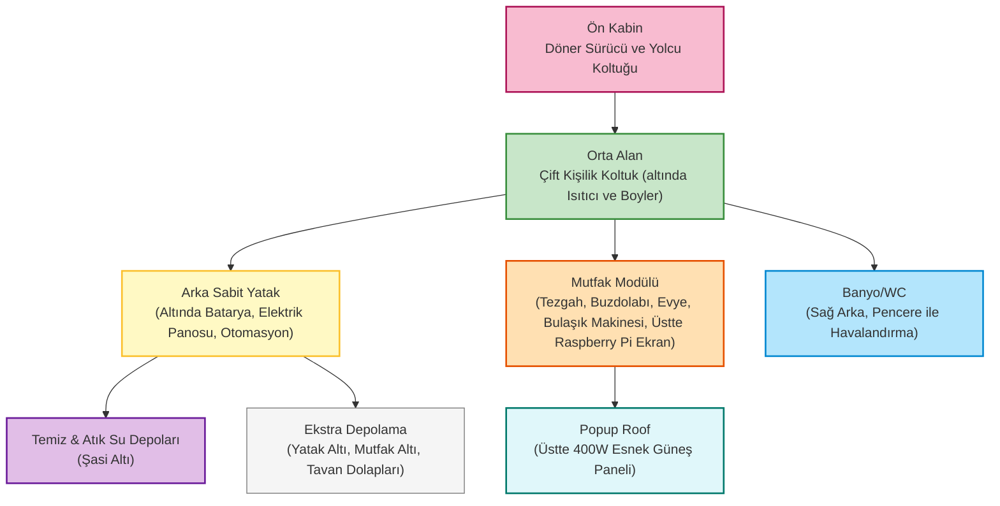

# 🚐 Karavan Projesi - Ducato Dönüşüm

Bu proje, Fiat Ducato L4H2 (SCA 214 popup roof) tabanlı bir karavanın tüm sistemlerinin profesyonel, modüler ve otomasyona uygun şekilde tasarlanıp uygulanmasını dokümante eder.

## 🚗 Araç Bilgileri

### Temel Özellikler
- **Marka/Model**: Fiat Ducato
- **Boyut**: L4H2 (Long Wheelbase, High Roof)
- **Uzunluk**: ~6.36m
- **Genişlik**: ~2.05m (ayna hariç)
- **Yükseklik**: ~2.52m (popup kapalı)
- **Popup Roof**: SCA 214

### Teknik Detaylar
- **Motor**: (detaylar eklenecek)
- **Yakıt**: (detaylar eklenecek)
- **Yük Kapasitesi**: (detaylar eklenecek)

## 🗺️ Genel Yerleşim ve Sistem Konseptleri

Aşağıdaki plan, karavanın ana yaşam ve teknik alanlarının yerleşimini ve sistemlerin entegrasyonunu özetler:



## 🏗️ Proje Alanları ve Modüller

Her sistem ayrı bir markdown dosyasında detaylandırılmıştır. Teknik bütünlük, güvenlik ve Home Assistant entegrasyonu ön plandadır.

### Tamamlanan ve Detaylandırılan Alanlar
- 🔋 [**Batarya Grubu**](Areas/battery-pack.md): 24V LiFePO4 prizmatik hücreler, akıllı BMS, RS485/CanBus ile Home Assistant entegrasyonu, güvenlik ve otomasyon. **Güneş paneli çıkışı doğrudan EasySolar-II'nin entegre MPPT girişine bağlanır.**
- ⚡ [**220V AC & Güneş Enerjisi**](Areas/220v.md): **Victron EasySolar-II 3kVA MPPT 250/70 GX** ile inverter, şarj cihazı ve MPPT tek cihazda birleşir. Shore power, galvanik izolasyon, akıllı dağıtım ve Home Assistant entegrasyonu.
- 🚿 [**Sıcak Su Sistemi**](Areas/hot-water.md): Quick Nautic Boiler B3, motor entegreli ısıtma, otomasyon, donma koruması ve Home Assistant entegrasyonu.
- 🔌 [**DC-DC Alternatör Şarj**](Areas/dc-charge-alternator.md): Victron Orion XS ile alternatörden yaşam aküsüne şarj, izleme ve otomasyon.
- 🟦 [**Popup Roof & Güneş Paneli**](Areas/popup-roof.md): SCA 214 popup roof üzerine entegre esnek 400W güneş paneli ve montaj detayları.
- 💧 [**Temiz Su Sistemi**](Areas/clean-water.md): 150L depo, RS485/analog seviye sensörü, otomatik drenaj, donma koruması, 24V pompa ve genleşme kabı, Home Assistant ile izleme ve otomasyon. **Depolar şasi altında.**
- 🤖 [**Otomasyon & Kontrol**](Areas/automation.md): Raspberry Pi CM4, endüstriyel Waveshare IoT modülleri, Modbus röleler ve analog girişler ile Home Assistant tabanlı merkezi otomasyon ve izleme altyapısı. **Tüm otomasyon ve izleme arka yatak altındaki teknik alanda.**
- 🔥 [**Isıtma Sistemi**](Areas/heating.md): Eberspacher D4L 4kW 24V dizel hava ısıtıcısı, otomasyon ve Home Assistant entegrasyonu, donma koruması, merkezi sıcaklık yönetimi. **Koltuk altı montaj.**
- 🍳 [**Mutfak Modülü**](Areas/kitchen.md): Wallas 1200D dizel ocak, EvaCool 90L 24V buzdolabı, tek musluklu evye (termostatik karışım), Electrolux bulaşık makinesi, 220V/24V/12V prizler, push button ile otomasyonlu aydınlatma, Home Assistant entegrasyonu, fonksiyonel ve modüler tezgah.

### Planlanacak Alanlar
- 🛏️ **Yatak Alanı** - Popup roof entegrasyonu
- 🍳 **Mutfak** - Ocak, buzdolabı, depolama
- 🚿 **Banyo** - Duş, tuvalet, lavabo (pencere ile havalandırma)
- 🪑 **Oturma Alanı** - Dinlenme ve yemek alanı
- 📡 **Haberleşme** - WiFi, TV, anten sistemleri
- 🗄️ **Depolama** - Dolap, raf, gizli bölmeler

## 📋 Proje Durumu

| Alan                        | Durum         | Tamamlanma |
|-----------------------------|---------------|------------|
| Batarya Grubu               | 🟢 Detaylandı | 90%        |
| 220V AC & Güneş Sistemi     | 🟢 Detaylandı | 90%        |
| Sıcak Su Sistemi            | 🟢 Detaylandı | 90%        |
| DC-DC Alternatör Şarj       | 🟢 Detaylandı | 90%        |
| Popup Roof & Güneş Paneli   | 🟢 Detaylandı | 90%        |
| Temiz Su Sistemi            | 🟢 Detaylandı | 90%        |
| Otomasyon & Kontrol         | 🟢 Detaylandı | 90%        |
| Isıtma Sistemi              | 🟢 Detaylandı | 90%        |
| Yatak Alanı                 | ⚪ Başlanmadı | 0%         |
| Mutfak                      | 🟢 Detaylandı | 90%        |
| Banyo                       | ⚪ Başlanmadı | 0%         |
| Oturma Alanı                | ⚪ Başlanmadı | 0%         |
| Haberleşme                  | ⚪ Başlanmadı | 0%         |
| Depolama                    | ⚪ Başlanmadı | 0%         |

## 🎯 Hedefler

### Kısa Vadeli (1-3 ay)
- [x] Sıcak su sistemi detaylandırılması
- [x] Elektrik sistemi (24V DC, 220V AC, batarya, alternatör şarj, güneş paneli) planlaması
- [x] Temiz su, otomasyon ve ısıtma altyapısı planlaması
- [ ] Genel layout ve mekanik tasarım

### Orta Vadeli (3-6 ay)
- [ ] İzolasyon ve iç döşeme
- [ ] Temel sistemlerin kurulumu (24V DC altyapı)
- [ ] Su ve elektrik altyapısı

### Uzun Vadeli (6-12 ay)
- [ ] Tüm sistemlerin entegrasyonu (24V DC ana sistem)
- [ ] Test ve optimizasyon
- [ ] İlk seyahat hazırlığı

## 📁 Klasör Yapısı

```
campervan/
├── Areas/                  # Proje alanları (her sistem için ayrı markdown)
│   ├── battery-pack.md     # Batarya grubu
│   ├── 220v.md            # 220V AC & güneş sistemi
│   ├── hot-water.md       # Sıcak su sistemi
│   ├── dc-charge-alternator.md # Alternatör şarj
│   ├── popup-roof.md      # Popup roof ve güneş paneli
│   ├── clean-water.md     # Temiz su sistemi
│   ├── automation.md      # Otomasyon & kontrol altyapısı
│   ├── heating.md         # Isıtma sistemi
│   ├── kitchen.md         # Mutfak modülü
│   └── ...                # Diğer alanlar (eklenecek)
├── Documentation/         # Teknik dökümanlar (eklenecek)
├── Plans/                 # Çizimler ve planlar (eklenecek)
├── Budget/                # Bütçe takibi (eklenecek)
└── README.md              # Bu dosya
```

## 📝 Notlar

- Tüm elektrik altyapısı **24V DC** tabanlıdır. Yüksek verim, düşük kayıp ve güvenlik önceliklidir.
- **Home Assistant** entegrasyonu ile tüm sistemler merkezi olarak izlenebilir ve otomasyona açıktır.
- Her sistem modüler, profesyonel ve genişletilebilir şekilde planlanmıştır.
- Temiz su, otomasyon ve ısıtma altyapısı, donma koruması ve uzaktan izleme ile tam entegredir.
- Teknik detaylar ve ürün listeleri ilgili markdown dosyalarında bulunur.
- **Her modülün kendi markdown dosyasında, o sisteme ait 'Elektrik ve Su Tesisatı' başlığı altında enerji, su, otomasyon ve sensör altyapısı özetlenmiştir. Böylece bakım, genişletme ve entegrasyon kolayca takip edilebilir.**
- SCA 214 popup roof entegrasyonu ve mekanik alanlar ileride detaylandırılacaktır.
- **Güneş paneli olarak esnek 400W panel, popup roof üzerine entegre edilecektir.**
- **Banyo için tavan havalandırması (heki) mümkün değildir, pencere ile doğal havalandırma sağlanacaktır.**

## 🚀 Başlarken

1. Her yeni sistem/alan için `Areas/` klasörü altında markdown dosyası oluşturun
2. Teknik çizimler ve planlar için `Plans/` klasörünü kullanın
3. Bütçe takibi için `Budget/` klasörünü kullanın
4. Her değişiklik için git commit'leri yapın

---

*Bu proje sürekli güncellenmektedir. Her alan tamamlandıkça dokümantasyon genişletilecektir.* 