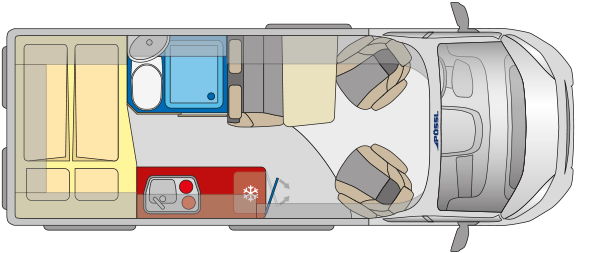

# 🚐 Karavan Projesi - Ducato Dönüşüm

Bu proje, Fiat Ducato L4H2 (SCA 214 popup roof) tabanlı bir karavanın tüm sistemlerinin profesyonel, modüler ve otomasyona uygun şekilde tasarlanıp uygulanmasını dokümante eder.

## 🚗 Araç Bilgileri

### Temel Özellikler
- **Marka/Model**: Fiat Ducato
- **Boyut**: L4H2 (Long Wheelbase, High Roof)
- **Uzunluk**: ~6.36m
- **Genişlik**: ~2.05m (ayna dahil)
- **Yükseklik**: ~2.52m (popup kapalı)
- **Popup Roof**: SCA 214

### Teknik Detaylar
- **Motor**: (detaylar eklenecek)
- **Yakıt**: (detaylar eklenecek)
- **Yük Kapasitesi**: (detaylar eklenecek)

## 🗺️ Genel Yerleşim ve Sistem Konseptleri

Aşağıda, modüllerin araç içindeki yaklaşık konumlarını gösteren genel yerleşim planı bulunmaktadır:



### Alan Dağılımı (Toplam ~400cm İç Alan)
- **Ana Yatak Alanı:** 150cm (araç boyunca, 150x200cm King size yatak enine yerleştirilmiş)
- **Banyo:** 120cm (duş, tuvalet, lavabo)
- **Oturma/Çalışma Alanı:** 130cm (koltuk + masa + ofis modu)

### Sistemlerin Konumları
- **Yatak Altı:** Akü, elektrik panosu, otomasyon
- **Şasi Altı:** Temiz/Gri su tankları
- **Mutfak:** Omake 1800W İndüksiyon Ocak, Buzdolabı, Bulaşık Makinesi
- **İsıtıcı & Sıcak Su:** Sürücü koltuğu altı (Truma Combi D4 inet - entegre ısıtma+sıcak su)
- **Banyo:** Sol arka köşe (120cm)
- **Popup Roof:** SCA 214, tavan üstü

## 🏗️ Proje Alanları ve Modüller

Her sistem ayrı bir markdown dosyasında detaylandırılmıştır. Teknik bütünlük, güvenlik ve Home Assistant entegrasyonu ön plandadır.

### Tamamlanan ve Detaylandırılan Alanlar
- 🔋 [**Batarya Grubu**](Areas/battery-pack.md): 24V LiFePO4 prizmatik hücreler, akıllı BMS, RS485/CanBus ile Home Assistant entegrasyonu, güvenlik ve otomasyon. **Güneş paneli çıkışı doğrudan EasySolar-II'nin entegre MPPT girişine bağlanır.**
- ⚡ [**220V AC & Güneş Enerjisi**](Areas/220v.md): **Victron EasySolar-II 3kVA MPPT 250/70 GX** ile inverter, şarj cihazı ve MPPT tek cihazda birleşir. Shore power, akıllı dağıtım ve Home Assistant entegrasyonu.

- 🔌 [**DC-DC Alternatör Şarj**](Areas/dc-charge-alternator.md): Victron Orion XS ile alternatörden yaşam aküsüne şarj, izleme ve otomasyon.
- 🟦 [**Popup Roof & Güneş Paneli**](Areas/popup-roof.md): SCA 214 popup roof üzerine entegre esnek 400W güneş paneli ve montaj detayları.
- 💧 [**Temiz Su Sistemi**](Areas/clean-water.md): 150L depo, RS485/analog seviye sensörü, otomatik drenaj, donma koruması, 24V pompa ve genleşme kabı, Home Assistant ile izleme ve otomasyon. **Depolar şasi altında.**
- 🤖 [**Otomasyon & Kontrol**](Areas/automation.md): Raspberry Pi CM4, endüstriyel Waveshare IoT modülleri, Modbus röleler ve analog girişler ile Home Assistant tabanlı merkezi otomasyon ve izleme altyapısı. **Tüm otomasyon ve izleme arka yatak altındaki teknik alanda.**
- 🔥 [**Isıtma ve Sıcak Su Sistemi**](Areas/heating.md): Truma Combi D4 inet 4kW dizel kombi sistemi, hem ısıtma hem sıcak su tek cihazda, 10L tank, inet kontrolü, otomasyon ve Home Assistant entegrasyonu, donma koruması. **Koltuk altı montaj.**
- 🍳 [**Mutfak Modülü**](Areas/kitchen.md): Omake 1800W ankastre indüksiyon ocak, EvaCool 90L 24V buzdolabı, tek musluklu evye (termostatik karışım), Electrolux bulaşık makinesi, 220V/24V/12V prizler, push button ile otomasyonlu aydınlatma, Home Assistant entegrasyonu, fonksiyonel ve modüler tezgah.
- 💧 [**Gri Su Sistemi**](Areas/grey-water.md): 100-120L atık su depolama, 24V pompa, seviye sensörü, otomatik/manuel boşaltma, koku ve donma koruması, Home Assistant ile izleme ve otomasyon. **Şasi altında güvenli montaj.**
- 🛏️ [**Ana Yatak Alanı**](Areas/main-bed.md): 150cm alan (araç boyunca), 150x200cm King size yatak (enine yerleştirilmiş), Flarespace ile genişletilmiş 200-205cm iç alan, yatak altı depolama ve teknik ekipman alanı, 24V klima ve heki roof window ile otomasyon entegrasyonu.
- 🔝 [**Popup Yatak Alanı**](Areas/popup-bed.md): SCA 214 popup roof içinde 130x200cm yatak, 400W güneş paneli entegrasyonu, panoramik görüş, ek yaşam alanı ve enerji üretimi.
- 🪑 [**Oturma Alanı**](Areas/seating.md): 2 kişilik emniyet kemerli koltuk, dönerli sürücü koltuğu, yükseklik ayarlı masa, Samsung 32" Smart Monitor M8 4K (bilgisayar + Android TV), çalışma/ofis modu, Home Assistant entegrasyonu.
- 🚿 [**Banyo**](Areas/banyo.md): 120cm kompakt banyo alanı, duş kabini, Clesana C1 susuz tuvalet (12V, 0.55Wh/flush), lavabo, pencere havalandırma, Home Assistant otomasyon, tam fonksiyonel banyo çözümü.

### Planlanacak Alanlar
- 📡 **Haberleşme** - WiFi, TV, anten sistemleri
- 🗄️ **Depolama** - Dolap, raf, gizli bölmeler

## 📋 Proje Durumu

| Alan                        | Durum         | Tamamlanma |
|-----------------------------|---------------|------------|
| Batarya Grubu               | 🟢 Detaylandı | 90%        |
| 220V AC & Güneş Sistemi     | 🟢 Detaylandı | 90%        |
| Sıcak Su Sistemi            | 🟢 Detaylandı | 90%        |
| DC-DC Alternatör Şarj       | 🟢 Detaylandı | 90%        |
| Popup Roof & Güneş Paneli   | 🟢 Detaylandı | 90%        |
| Temiz Su Sistemi            | 🟢 Detaylandı | 90%        |
| Otomasyon & Kontrol         | 🟢 Detaylandı | 90%        |
| Isıtma Sistemi              | 🟢 Detaylandı | 90%        |
| Ana Yatak Alanı             | 🟢 Detaylandı | 90%        |
| Popup Yatak Alanı           | 🟢 Detaylandı | 90%        |
| Mutfak                      | 🟢 Detaylandı | 90%        |
| Gri Su Sistemi              | 🟢 Detaylandı | 90%        |
| Oturma Alanı                | 🟢 Detaylandı | 90%        |
| Banyo                       | 🟢 Detaylandı | 90%        |
| Haberleşme                  | ⚪ Başlanmadı | 0%         |
| Depolama                    | ⚪ Başlanmadı | 0%         |

## 🎯 Hedefler

### Kısa Vadeli (1-3 ay)
- [x] Elektrik sistemi (24V DC, 220V AC, batarya, alternatör şarj, güneş paneli) planlaması
- [x] Temiz su, otomasyon, ısıtma ve sıcak su altyapısı planlaması
- [x] Gri su sistemi planlaması
- [x] Mutfak modülü detaylandırılması
- [x] Ana yatak alanı planlaması (150cm alan, 150x200cm King size yatak enine yerleştirilmiş, Flarespace ile)
- [x] Popup yatak alanı planlaması (güneş paneli entegrasyonu)
- [x] Oturma alanı planlaması (ofis/çalışma modu)
- [x] Banyo sistemi planlaması (120cm kompakt banyo)
- [ ] Genel layout ve mekanik tasarım

### Orta Vadeli (3-6 ay)
- [ ] İzolasyon ve iç döşeme
- [ ] Temel sistemlerin kurulumu (24V DC altyapı)
- [ ] Su ve elektrik altyapısı

### Uzun Vadeli (6-12 ay)
- [ ] Tüm sistemlerin entegrasyonu (24V DC ana sistem)
- [ ] Test ve optimizasyon
- [ ] İlk seyahat hazırlığı

## 📁 Klasör Yapısı

```
campervan/
├── Areas/                     # Proje alanları (her sistem için ayrı markdown)
│   ├── battery-pack.md        # Batarya grubu
│   ├── 220v.md                # 220V AC & güneş sistemi
│   ├── dc-charge-alternator.md # Alternatör şarj
│   ├── popup-roof.md          # Popup roof ve güneş paneli
│   ├── clean-water.md         # Temiz su sistemi
│   ├── automation.md          # Otomasyon & kontrol altyapısı
│   ├── heating.md             # Isıtma ve sıcak su sistemi
│   ├── kitchen.md             # Mutfak modülü
│   ├── grey-water.md          # Gri su sistemi
│   ├── main-bed.md            # Ana yatak alanı
│   ├── popup-bed.md           # Popup yatak alanı
│   ├── seating.md             # Oturma alanı
│   ├── banyo.md               # Banyo
│   └── ...                    # Diğer alanlar (eklenecek)
├── Automation/                # Home Assistant ve otomasyon konfigürasyonları
│   ├── readme.md              # Sistem mimarisi, IO haritası, cihaz listeleri
│   └── ha-configs/            # Home Assistant konfigürasyon dosyaları
│       ├── helpers/           # Button helpers (input_datetime, input_number, input_boolean)
│       ├── automations/       # Button detection ve action automations
│       ├── modbus_combined.yaml # Modbus cihaz tanımları
│       ├── deploy.py          # 🚀 Otomatik deployment script
│       ├── README.md          # Konfigürasyon dokümantasyonu ve troubleshooting
│       └── KURULUM.md         # Adım adım kurulum rehberi
├── simulators/                # Waveshare modül simülatörleri (geliştirme/test için)
│   ├── venv/                  # Python virtual environment (pymodbus)
│   ├── waveshare-latching-relay-01/ # Relay 01: Aydınlatma (Port 5023)
│   │   ├── simulator.py       # Modbus TCP simülatör
│   │   ├── config.py          # Merkezi konfigürasyon
│   │   ├── kontrol.py         # Röle kontrol utility
│   │   ├── izle.py            # Real-time monitoring
│   │   ├── ha-config.yaml     # Home Assistant entegrasyonu
│   │   └── README.md          # Dokümantasyon
│   ├── waveshare-latching-relay-02/ # Relay 02: Banyo + Su Sistemi (Port 5025)
│   │   └── ... (aynı dosya yapısı)
│   ├── waveshare-latching-relay-03/ # Relay 03: Yüksek Tüketim (Port 5026)
│   │   └── ... (aynı dosya yapısı)
│   └── waveshare-di-do-01/    # 8DI/8DO modül simülatörü (Port 5024)
│       ├── simulator.py       # Push button simülasyonu dahil
│       ├── config.py          # Merkezi konfigürasyon
│       ├── kontrol.py         # DI/DO kontrol utility
│       ├── izle.py            # Real-time monitoring
│       ├── ha-config.yaml     # Home Assistant entegrasyonu
│       └── README.md          # Dokümantasyon
├── Assets/                    # Görseller, çizimler
│   └── Images/
│       └── layout.png         # Fiziksel yerleşim planı
├── Documentation/             # Teknik dökümanlar (eklenecek)
├── Plans/                     # Çizimler ve planlar (eklenecek)
├── Budget/                    # Bütçe takibi (eklenecek)
└── README.md                  # Bu dosya
```

## 📝 Notlar

- Tüm elektrik altyapısı **24V DC** tabanlıdır. Yüksek verim, düşük kayıp ve güvenlik önceliklidir.
- **Home Assistant** entegrasyonu ile tüm sistemler merkezi olarak izlenebilir ve otomasyona açıktır.
- Her sistem modüler, profesyonel ve genişletilebilir şekilde planlanmıştır.
- Temiz su, otomasyon ve ısıtma altyapısı, donma koruması ve uzaktan izleme ile tam entegredir.
- Teknik detaylar ve ürün listeleri ilgili markdown dosyalarında bulunur.
- **Her modülün kendi markdown dosyasında, o sisteme ait 'Elektrik ve Su Tesisatı' başlığı altında enerji, su, otomasyon ve sensör altyapısı özetlenmiştir. Böylece bakım, genişletme ve entegrasyon kolayca takip edilebilir.**
- SCA 214 popup roof entegrasyonu ve mekanik alanlar ileride detaylandırılacaktır.
- **Güneş paneli olarak esnek 400W panel, popup roof üzerine entegre edilecektir.**
- **Banyo için tavan havalandırması (heki) mümkün değildir, pencere ile doğal havalandırma sağlanacaktır.**

## 🚀 Başlarken

1. Her yeni sistem/alan için `Areas/` klasörü altında markdown dosyası oluşturun
2. Teknik çizimler ve planlar için `Plans/` klasörünü kullanın
3. Bütçe takibi için `Budget/` klasörünü kullanın
4. Her değişiklik için git commit'leri yapın

## 🧪 Geliştirme ve Test

### Waveshare Modül Simülatörleri

Gerçek donanım olmadan geliştirme ve test için Modbus TCP simülatörleri mevcuttur:

**1. Simülatörleri Başlat:**
```bash
# Python venv'i aktif et
cd simulators
source venv/bin/activate

# 4 ayrı terminal'de simülatörleri başlat:
# Terminal 1: Relay 01 - Aydınlatma (Port 5023)
cd waveshare-latching-relay-01 && python3 simulator.py

# Terminal 2: DI/DO - Push Buttons (Port 5024)
cd waveshare-di-do-01 && python3 simulator.py

# Terminal 3: Relay 02 - Banyo + Su (Port 5025)
cd waveshare-latching-relay-02 && python3 simulator.py

# Terminal 4: Relay 03 - Yüksek Tüketim (Port 5026)
cd waveshare-latching-relay-03 && python3 simulator.py
```

**2. Home Assistant Konfigürasyonlarını Deploy Et:**
```bash
cd Automation/ha-configs
python3 deploy.py --auto  # Otomatik dosya transfer + reload
```

**3. Test Et:**
- Home Assistant → Developer Tools → States
- Binary sensor'lar otomatik değişir (push button simülasyonu)
- Light'ları toggle/on/off ile test et
- Event trace'lerini incele

**Özellikler:**
- ✅ **Dinamik IP desteği** (mDNS .local hostname)
- ✅ **Gerçekçi push button simülasyonu** (short/long/double press)
- ✅ **Real-time monitoring** (`izle.py`)
- ✅ **Manuel kontrol** (`kontrol.py`)
- ✅ **Otomatik deployment** (`deploy.py`)
- ✅ **Centralized config** (`config.py`)

Detaylı bilgi: `simulators/*/README.md` ve `Automation/ha-configs/README.md`

---

*Bu proje sürekli güncellenmektedir. Her alan tamamlandıkça dokümantasyon genişletilecektir.* 

